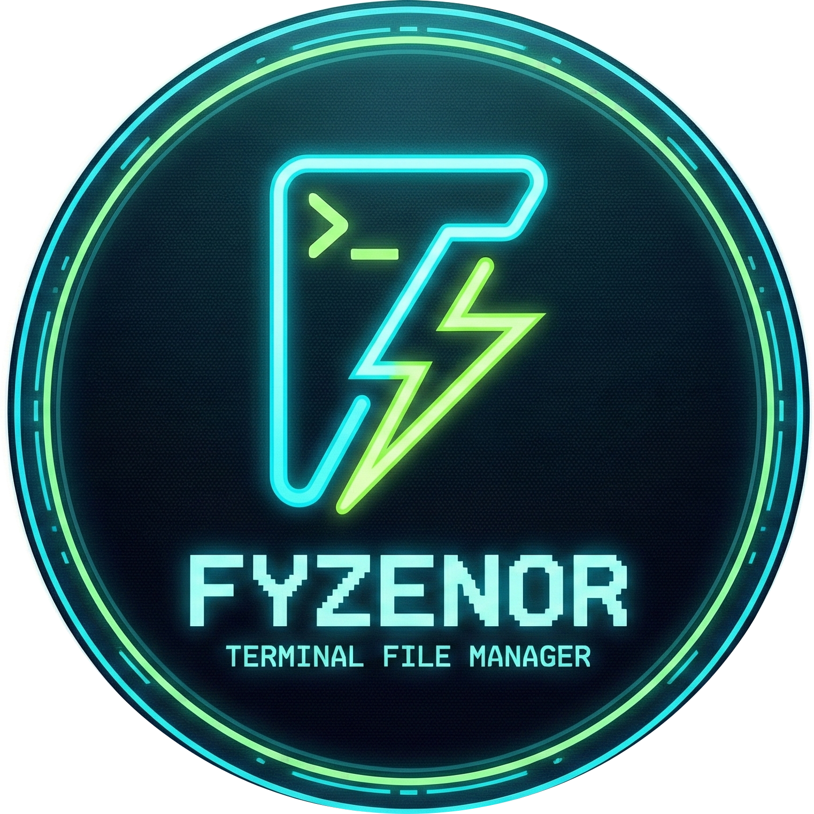
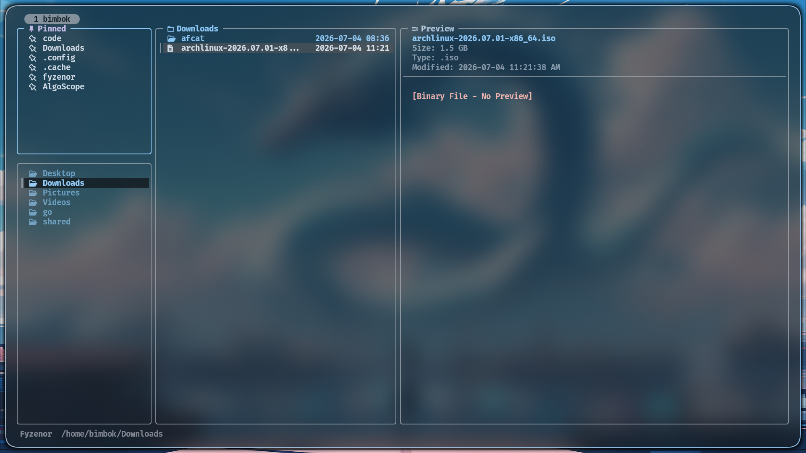
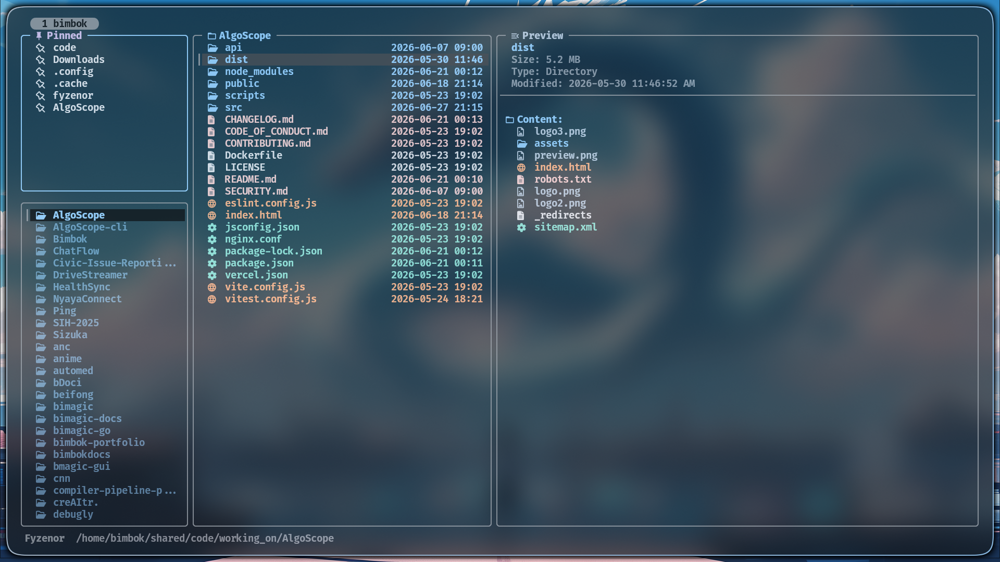
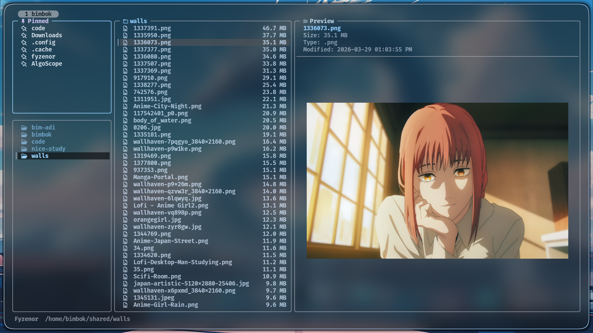
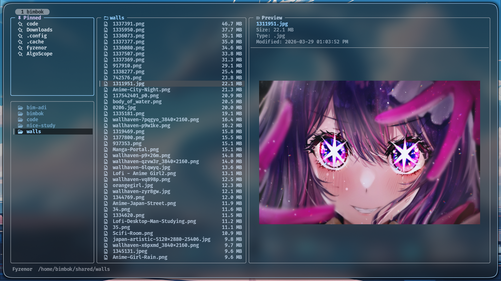
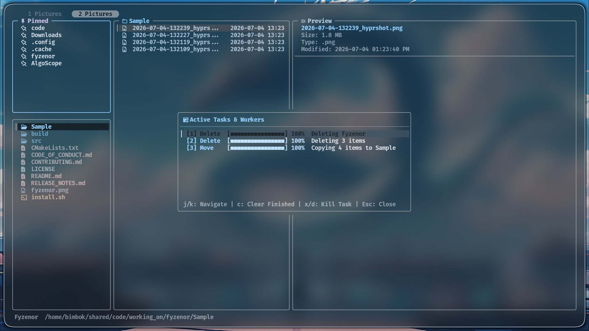
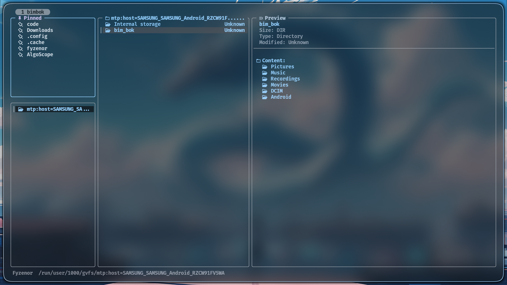
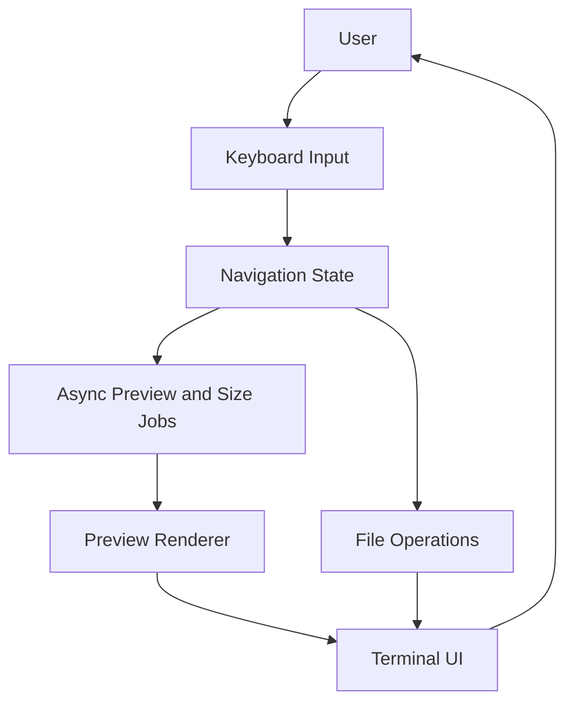

```text
╔══╦ ╦╔═╗╔═╗╔╗╔╔═╗╦═╗
╠══╚╦╝╔═╝║╣ ║║║║ ║╠╦╝
╩   ╩ ╚═╝╚═╝╝╚╝╚═╝╩╚═
```

<div align="center">


# Fyzenor

**A modern, blazing-fast terminal file manager built in C++ with live previews, async workflows, and a polished three-column interface.**

[](https://isocpp.org/)
[](https://invisible-island.net/ncurses/)
[](https://sw.kovidgoyal.net/kitty/graphics-protocol/)
[](#-quick-start)
[](#-cli-usage)
[](https://fyzenor.vercel.app/)

### Maintainer

<table>
  <tr>
    <td align="center" style="padding: 8px 18px;">
      <a href="https://github.com/Bimbok">
        
      </a>
      <br />
      <a href="https://github.com/Bimbok"><strong>@Bimbok</strong></a>
      <br />
      <sub>Creator / Maintainer</sub>
    </td>
  </tr>
</table>

<sub>Fyzenor is designed and maintained by Bimbok.</sub>

</div>

---

## ⚡ Introduction

**Fyzenor** is a lightweight, high-performance terminal file manager engineered from the ground up with modern **C++17**. It is designed to bridge the gap between the raw power of the command line and the visual feedback of modern GUIs.

With its asynchronous architecture, Fyzenor ensures that heavy operations like directory size calculation and media preview generation never block the UI, providing a "blazing fast" experience even on large filesystems. Whether you are a developer, a system administrator, or a power user, Fyzenor allows you to navigate and manage your files with the speed of thought.

🌐 **Official Documentation:** [fyzenor.vercel.app](https://fyzenor.vercel.app/)

---

## 🖼️ Interface Preview

<div align="center">


<br /><br />

<br /><br />

<br /><br />

<br /><br />

<br /><br />


</div>

---

## 🚀 Key Features

| Feature                            | Description                                                                                                                                           |
| ---------------------------------- | ----------------------------------------------------------------------------------------------------------------------------------------------------- |
| **Three-Column Layout**            | Navigate with a Miller-style layout showing pinned items, parent/current directories, and a live preview pane.                                        |
| **Asynchronous Tabs**              | Open multiple directories in native tabs, navigating easily with `[`/`]` and number keys `1`-`9`, preserving your selections.                       |
| **Interactive Shell Commands**     | Execute shell commands globally with `:`. Supports foreground utilities, background tasks (`&`), and path placeholders (`$f`/`$s`).                 |
| **Bulk Rename via Editor**         | Select multiple files and press `r` to rename them all at once inside your default text editor (e.g. `nvim`, `nano`).                                 |
| **Smart Copy Resumption**         | Resumes interrupted file copies block-by-block (`seekg`/`seekp`) by comparing file sizes and copying only the remaining bytes.                        |
| **Task Play/Pause Controls**      | Suspend (pause) and resume background copy, move, delete, zip, and extract tasks directly from the task list.                                         |
| **Freedesktop Trash System**      | Move items to trash (`d`) and restore/empty them in-build. Integrates home trash and local partition trash folders.                                  |
| **Undo Trash Action (`u`)**        | Undo the last move-to-trash action instantly, restoring items back to their original paths.                                                           |
| **Dynamic Disk Space Status**     | Displays partition name, progress bar, percent used, and free space dynamically for the current drive.                                                |
| **Dynamic Empty Folder Icons**    | Instantly identifies empty directories (` `) versus populated ones (` `) using fast metadata caching.                                               |
| **Simultaneous Multi-Open**        | Open all selected files simultaneously; code/text files load in a single editor, media in an `mpv` playlist, others in background launchers.         |
| **Robust Symlink Management**     | Custom link icons (`󰌹`), detailed resolution preview (detects broken paths), and quick absolute symlink pasting with Shift+Y (`Y`).                 |
| **Dynamic Sorting Modes**          | Toggle sorting order dynamically by pressing `s`, cycling between **Name**, **Size (Desc)**, and **Date Modified (Desc)**.                             |
| **Async Media Preview**            | Generate image and video previews in the background using the Kitty Graphics Protocol and `ffmpeg`, without freezing navigation.                      |
| **Modern & Polished UI**           | A clean, minimal interface featuring rounded corners, optimized spacing, and an elegant color palette designed for long-term readability and comfort. |
| **Syntax-Aware Text Preview**      | Preview code and text files with `bat` or `batcat`, with fallback to plain text when needed.                                                          |
| **Background Folder Sizing**       | Directory sizes are calculated asynchronously and update in place while you keep moving.                                                              |
| **Vim-Style Navigation**           | Fast keyboard-driven navigation with `h`, `j`, `k`, `l`, `g`, `G`, arrow keys, and enter-based traversal.                                             |
| **Nerd Fonts Integration**         | Rich iconography for directories, archives, media, and code file formats for faster visual identification.                                            |
| **Multi-Selection & Bulk Actions** | Select multiple files and apply copy, cut, paste, delete, and zip operations efficiently.                                                             |
| **Persistent Pins**                | Save frequently used directories to `~/.fm_pins` and jump back to them instantly.                                                                     |
| **Flicker-Free Rendering**         | Optimized redraw behavior keeps the interface smooth while reducing unnecessary terminal updates.                                                     |
| **Rich File Operations**           | Create files/folders, rename entries, zip selections, copy absolute paths, and manage content without leaving the TUI.                                |
| **Theme Support**                  | Customize the UI through `~/.config/fyzenor/colors.fz`, with optional Matugen-powered wallpaper theming.                                              |
| **Archive Previewer**              | Inspect contents of `.zip`, `.tar.gz`, `.rar`, `.7z` archives directly in the TUI preview pane without extracting them.                                |
| **Media Metadata Inspector**        | Read codec names, bitrates, dimensions, sample rates, title, and artist metadata tags for images, audio, and video tracks.                             |
| **Custom Key Macros**              | Map single-key binds in `~/.config/fyzenor/keys.fz` to run terminal macros with path placeholders (`$f`, `$s`).                                         |
| **Editor Integration**             | Opens text/code files with your configured editor via `$EDITOR` or `$VISUAL`, with sensible fallbacks.                                                |
| **Content Search (ripgrep)**       | Search for file contents under the current directory using `ripgrep`, displaying relative paths and supporting vim-like navigation.                   |
| **Manual Cache Refresh**           | Refresh directory contents and invalidate sizes/previews cache instantly using `F5` / `Ctrl+R`.                                                      |
| **Dual-Pane Mode**                 | Toggle (`F2`) side-by-side active file listings for drag-free copying, with easy tab focus switching (`Tab`).                                         |
| **Device Detection & Mounts**      | Detect, mount, unmount, and navigate connected USB block drives and mobile phones (Android MTP) natively without needing Nautilus.                     |
| **Live Auto-Updates (inotify)**    | Automatically detects filesystem changes (creations, deletions, renames) in the current directory and refreshes the TUI instantly.                    |

---

## 🛠️ Tech Stack

### Core

- **Language:** C++17
- **UI Layer:** `ncursesw`
- **Concurrency:** C++ threads with mutex-protected async workflows
- **Filesystem:** `std::filesystem`

### External Tools

- **Preview Rendering:** Kitty Graphics Protocol
- **Image & Video Thumbnailing:** `ffmpeg`
- **Syntax Highlighting:** `bat` or `batcat` (rendered in color via custom ncurses ANSI parser)
- **File Content Searching:** `ripgrep` (`rg`)
- **Archive Support:** `zip`
- **Clipboard Support:** `xclip`, `wl-copy`, or `pbcopy`

---

## 🛠️ Prerequisites

To unleash the full power of Fyzenor, especially image previews, your system needs a few core components.

### 1. A Compatible Terminal

- **Recommended:** [Kitty](https://sw.kovidgoyal.net/kitty/) with native Kitty Graphics Protocol support.
- **Others:** [WezTerm](https://wezfurlong.org/wezterm/) or [Konsole](https://konsole.kde.org/) may work, but Kitty is the primary development and testing target.

### 2. System Dependencies

On Debian-based or Ubuntu-based systems:

```bash
sudo apt update
sudo apt install build-essential libncursesw5-dev ffmpeg zip bat xclip wl-copy ripgrep
```
On Fedora-based systems:

```bash
sudo dnf update
sudo dnf install gcc gcc-c++ make ncurses-devel ffmpeg zip bat xclip wl-clipboard ripgrep
```
On Arch Linux-based systems:

```bash
sudo pacman -Sy
sudo pacman -S base-devel ncurses ffmpeg zip bat xclip wl-clipboard ripgrep
```
On Termux (Android) environments:

```bash
pkg update
pkg install clang cmake ndk-sysroot ncurses-utils ffmpeg zip bat ripgrep
```

- **`libncursesw`, `ncurses`, or `ncurses-utils`**: Essential for wide-character terminal rendering.
- **`ffmpeg`**: Powers asynchronous thumbnail generation for images and videos.
- **`zip`**: Required for built-in archive creation.
- **`bat` or `batcat`**: Used for syntax-highlighted text previews.
- **`xclip` / `wl-copy` / `pbcopy`**: Used for the copy-path feature.

---

## ⚙️ Installation & Update

The easiest way to install or update Fyzenor is using the universal installation script.
### Windows Compiler Compatibility

Fyzenor requires a compiler with proper C++17 filesystem support.

Older MinGW GCC versions (such as GCC 6.x) may fail during compilation with:

```bash
fatal error: filesystem: No such file or directory
```

Recommended environments for Windows users:

- MSYS2 MinGW-w64
- WSL (Windows Subsystem for Linux)

Recommended compiler versions:
- GCC 8+
- Clang 7+

You can check your compiler version using:

```bash
g++ --version
```

### One-Liner

```bash
curl -fsSL https://raw.githubusercontent.com/Bimbok/fyzenor/main/install.sh | bash
```

### Manual Installation & Updates

```bash
# 1. Clone the repository
git clone https://github.com/Bimbok/fyzenor.git

# 2. Enter the repository
cd fyzenor

# 3. Run the installer
./install.sh
```

The installer:

1. Compiles the C++ source into an optimized binary.
2. Installs `fyzenor` into `/usr/local/bin/`.
3. Creates an `fm` symlink for faster access.
4. Installs the desktop application shortcut and branding icon globally.

---

## 🚀 Quick Start

If you want to build and run Fyzenor manually instead of using the installer:

```bash
git clone https://github.com/Bimbok/fyzenor.git
cd fyzenor
mkdir -p build && cd build
cmake ..
make
./fyzenor
```

This route is useful if you want direct control over compilation or want to test local modifications before installation.

## 🔍 Rich Previews

### Archive Tree Previewer
Fyzenor reads `.zip`, `.tar.gz`, `.tgz`, `.7z`, and `.rar` archive tables on the fly without extraction. It leverages background listing tools (`unzip`, `tar`, `7z`, `unrar`) to display a neat directory layout right in the preview pane.

### Media Metadata Inspector
Get information about your media files (`.mp4`, `.mp3`, `.mov`, `.png`, `.jpg`, etc.) dynamically. The preview worker uses `mediainfo` or `ffprobe` (via `ffmpeg`) to show streams metadata, codecs, channels, sample rates, and tags.

### PDF Text Layout Previewer
If `pdftotext` (from `poppler-utils`) is installed on your system, Fyzenor asynchronously extracts and renders the formatted text layouts of the first 3 pages of `.pdf` files directly in the preview pane.

## ⚙️ External Configuration (`config.toml`)

Fyzenor uses an external configuration file located at `~/.config/fyzenor/config.toml` (automatically created on first launch or during installation). It allows you to customize the program's general options, panel sizes, pane visibility rules, icon glyphs (Nerd Fonts), and file extension mappings.

### Configuration Format

Here is the fully documented default structure of `~/.config/fyzenor/config.toml`:

```toml
[general]
# Show hidden files by default on startup
show_hidden = false

# Default sorting mode: "name", "size" (descending), or "date" (descending)
sort_mode = "name"

[layout]
# Proportional width of the left parent/pinned column in normal mode (ratio between 0.0 and 1.0)
parent_width = 0.18

# Proportional width of the central files list column in normal mode
current_width = 0.32

# Set to true to hide the rightmost file preview pane by default on startup (toggleable via F3)
hide_preview = false

# Set to true to hide the leftmost parent/pinned navigation sidebar by default on startup (toggleable via F4)
hide_parent = false

[icons]
# Custom glyphs for directory and file indicators (Nerd Fonts recommended)
dir = " "
video = " "
image = " "
core = " "
frontend = "󰖟 "
config = " "
script = " "
docs = " "
font = " "
file = " "
music = " "
pin = " "
zip = "󰿺 "
link = "󰌹 "

[categories]
# Map specific file extensions to styling and icon categories
video = [".mp4", ".mkv", ".avi", ".mov", ".flv", ".wmv", ".webm", ".m4v", ".mpg", ".mpeg"]
image = [".png", ".jpg", ".jpeg", ".gif", ".bmp", ".webp", ".svg", ".tiff", ".ico", ".psd", ".ai"]
frontend = [".js", ".jsx", ".ts", ".tsx", ".css", ".scss", ".sass", ".less", ".styl", ".vue", ".html", ".svelte", ".htm", ".astro", ".mjx", ".dart", ".swift"]
scripts = [".sh", ".bash", ".zsh", ".fish", ".ksh", ".command", ".pl", ".pm", ".t", ".awk", ".ps1", ".psm1", ".bat", ".cmd", ".vbs", ".wsf"]
config = [".json", ".json5", ".jsonc", ".xml", ".xsd", ".xsl", ".gpx", ".yaml", ".yml", ".toml", ".ini", ".conf", ".cfg", ".prefs", ".properties", ".lock", ".env", ".dockerfile", ".gitignore", ".gitconfig", ".gitattributes", ".gitmodules"]
documentation = [".md", ".markdown", ".txt", ".text", ".log", ".pdf", ".doc", ".docx", ".odt", ".rtf", ".ppt", ".pptx", ".odp", ".xls", ".xlsx", ".ods", ".csv"]
core = [".py", ".pyw", ".ipynb", ".pyc", ".pyd", ".rb", ".ru", ".gemspec", ".php", ".cpp", ".cxx", ".cc", ".hpp", ".hxx", ".ixx", ".c", ".h", ".rs", ".java", ".class", ".jar", ".war", ".go", ".lua", ".sql", ".db", ".sqlite", ".sqlite3", ".db3", ".mdb", ".accdb", ".cmake", ".make", ".diff", ".patch", ".kt", ".kts", ".cs", ".csx", ".scala", ".sc", ".hs", ".lhs", ".clj", ".cljs", ".cljc", ".edn", ".r", ".rmd", ".jl", ".fs", ".fsi", ".fsx"]
font = [".woff", ".woff2", ".ttf", ".eot", ".otf"]
audio = [".mp3", ".wav", ".flac", ".m4a", ".aac", ".ogg", ".wma", ".opus", ".mid", ".midi"]
archive = [".zip", ".tar", ".gz", ".tgz", ".7z", ".rar", ".xz", ".bz2", ".tbz2", ".lzma", ".cab"]
```

---

## 🎨 Customization & Theming

Fyzenor supports custom themes via `~/.config/fyzenor/colors.fz`. The default theme is **Catppuccin Mocha**.

### Configuration Format

Create `~/.config/fyzenor/colors.fz` and define colors using hex codes:

```text
DIR: #89b4fa
FILE: #cdd6f4
SEL_BG: #585b70
MEDIA: #f9e2af
IMAGE: #f5c2e7
BORDER: #b4befe
SUCCESS: #a6e3a1
ERROR: #f38ba8
MULTI: #fab387
PIN_BG: #cba6f7
PIN_BORDER: #89b4fa
SEC_SEL_BG: #313244
CODE: #a6e3a1
ARCHIVE: #eba0ac
```

### Wallpaper-Based Theming (Matugen)

Instead of manually writing colors, you can use **Matugen** to generate a theme that matches your current wallpaper.

#### Step 1: Create the Matugen Template

Create `~/.config/matugen/templates/fyzenor-colors.template`:

```text
# Fyzenor Theme: Matugen Generated
DIR: {{colors.primary.default.hex}}
FILE: {{colors.on_surface.default.hex}}
SEL_BG: {{colors.surface_variant.default.hex}}
MEDIA: {{colors.tertiary.default.hex}}
IMAGE: {{colors.secondary.default.hex}}
BORDER: {{colors.outline.default.hex}}
SUCCESS: {{colors.primary_fixed.default.hex}}
ERROR: {{colors.error.default.hex}}
MULTI: {{colors.tertiary_container.default.hex}}
PIN_BG: {{colors.secondary_container.default.hex}}
PIN_BORDER: {{colors.primary.default.hex}}
SEC_SEL_BG: {{colors.surface_dim.default.hex}}
```

#### Step 2: Update your Matugen Config

Add this block to your `~/.config/matugen/config.toml`:

```toml
[templates.fyzenor]
input_path = "~/.config/matugen/templates/fyzenor-colors.template"
output_path = "~/.config/fyzenor/colors.fz"
```

#### Step 3: Generate the Colors

```bash
matugen image /path/to/your/wallpaper.jpg
```

---

### 🛠️ Custom Keyboard Macros (`keys.fz`)

You can map single-key shortcuts to run shell commands on currently highlighted or selected files. 

Create `~/.config/fyzenor/keys.fz` and specify key mappings:

```text
# Syntax: key_character=shell_command
# $f - Expands to highlighted file path
# $s - Expands to space-separated selected paths (falls back to $f if none selected)

v=nvim "$f"
g=git diff
l=ls -la
```

When a custom key is pressed inside the browser panel (e.g. `v`), Fyzenor suspends NCurses mode, executes the command directly inside the currently browsed directory in your interactive shell (giving you full access to standard I/O), waits for you to press Enter, and then returns to the file manager, reloading the directory.

---

## 🛠️ CLI Usage

Fyzenor supports the following command-line arguments:

| Option            | Description                            |
| :---------------- | :------------------------------------- |
| `-v`, `--version` | Display the current version of Fyzenor. |
| `-h`, `--help`    | Show the help message and exit.        |

```bash
fyzenor --version
```

---

## 🏗️ Architecture

Fyzenor is structured as a compact terminal application with asynchronous jobs handling the expensive operations that would otherwise block UI updates.

```text
fyzenor/
├── file_manager.cpp   # Core application logic, UI rendering, preview pipeline
├── install.sh         # Installer and shell integration bootstrap
├── fyzenor.png        # Branding asset used in the README
└── Sample/            # Showcase screenshots
```

### How It Works

1. **Navigation State:** Tracks the current directory, parent context, selected entry, pins, and multi-selection state.
2. **Async Preview Pipeline:** Generates media previews and text previews without freezing the navigation loop.
3. **Background Size Calculation:** Directory sizes are resolved in the background and merged back into the UI.
4. **Command Handling:** Keybindings trigger file operations, pin management, sorting, preview refresh, and shell integration behavior.

### System Flow



---

## ⌨️ Controls

### Navigation

| Key                   | Action                          |
| :-------------------- | :------------------------------ |
| `k` or `↑`            | Move selection up               |
| `j` or `↓`            | Move selection down             |
| `h` or `←` or `BS`    | Go to parent directory / Clear search results |
| `l` or `→` or `Enter` | **Open file** / Enter directory |
| `g`                   | Go to top of list               |
| `G`                   | Go to bottom of list            |
| `/`                   | **Search** content (ripgrep)    |
| `f`                   | **Fuzzy Find** files (internal) |
| `w`                   | **Active Tasks** manager overlay |
| `Ctrl+O`              | Go back in directory navigation history |
| `Ctrl+P`              | Go forward in directory navigation history |
| `H`                   | **History Overlay** (jump to recently visited directories) |

> **Note on Opening Files:** Fyzenor automatically detects text and code files and opens them using your terminal-based editor, respecting `$EDITOR`, `$VISUAL`, `nvim`, `nano`, then `vi`. Media files are opened with `mpv` if available, and other files use your system's default opener.

### File Operations

| Key             | Action                                               |
| :-------------- | :--------------------------------------------------- |
| `y`             | **Yank** (Copy) selected items to internal clipboard |
| `x`             | **Cut** selected items                               |
| `p`             | **Paste** items from clipboard                       |
| `Y`             | **Paste as Symlink** (absolute symlinks of clipboard)|
| `d` or `Delete` | **Move to Trash** (deletes permanently if inside Trash Manager) |
| `D`             | **Delete permanently** (skips Trash)                 |
| `T`             | **Toggle Trash Manager**                             |
| `u`             | **Undo** last move-to-trash action                   |
| `r`             | **Rename** current item (acts as **Restore** if inside Trash Manager) |
| `n`             | Create **New File**                                  |
| `N`             | Create **New Folder**                                |
| `z`             | **Zip** selected items into an archive               |
| `e`             | **Extract** archive (acts as **Empty Trash** if inside Trash Manager) |
| `c`             | **Copy Absolute Path** to system clipboard           |
| `I`             | **Visual Permissions & Ownership Editor** (inspect/edit chmod/chown) |

### Selection, View & Pins

| Key            | Action                                      |
| :------------- | :------------------------------------------ |
| `Space` or `v` | Toggle selection of current file            |
| `a`            | Select **All** files in current directory   |
| `Esc`          | **Clear** all active selections             |
| `.`            | Toggle hidden files                         |
| `s`            | Cycle sorting (**Name** $\rightarrow$ **Size** $\rightarrow$ **Date Modified**) |
| `P`            | Pin current directory                       |
| `Tab`          | Toggle focus between **Files** and **Pins** (or switch active panes in Dual-Pane mode) |
| `F2`           | Toggle **Dual-Pane mode** (split-screen side-by-side files lists) |
| `F3`           | Toggle **Preview Pane** visibility (normal mode only) |
| `F4`           | Toggle **Parent Pane** visibility (normal mode only) |
| `Ctrl+G`       | **Grow active pane width** (Dual-Pane mode only) |
| `Ctrl+B` / `Ctrl+H` | **Shrink active pane width** (Dual-Pane mode only) |
| `F5` or `Ctrl+R` | **Refresh** directory layout and clear size/preview caches |
| `i`            | Show **File Details** (permissions, owner, size, times) |
| `m`            | Show **Devices & Mounts** overlay (detect, mount, unmount USB drives & Android phones) |
| `:`            | **Execute Shell Command** (suspend TUI / background `&`) |
| `q`            | Quit Fyzenor                                |

### Tab Controls

| Key             | Action                                      |
| :-------------- | :------------------------------------------ |
| `t`             | **Create New Tab**                          |
| `W` or `Ctrl+W` | **Close Current Tab**                       |
| `[` or `]`      | Switch to **Previous / Next Tab**           |
| `1` - `9`, `0`  | Switch directly to **Tab 1 - 10** (`0` maps to tab 10) |

### Pin Mode Controls

- `j` / `k` or `↑` / `↓`: Navigate through your pins.
- `Enter` / `l` / `→`: Instantly jump to the pinned directory.
- `d` / `Delete`: Remove the selected pin.
- `Tab`: Switch focus back to the main file browser.

---

## 🎨 Visuals & Protocols

### Kitty Graphics Protocol

Fyzenor uses the [Kitty Graphics Protocol](https://sw.kovidgoyal.net/kitty/graphics-protocol/) for high-resolution image and video previews. Previews are generated asynchronously so the UI remains fluid during navigation.

### Nerd Fonts

Icons are rendered using [Nerd Fonts](https://www.nerdfonts.com/). Ensure your terminal is using a Nerd Font for icons to display correctly.

### Syntax Highlighting

Fyzenor integrates with `bat` or `batcat` to preview code and text files with rich syntax highlighting. Highlighted files are parsed directly into standard ncurses colors via a custom ANSI escape parser.

## 󰩹 Trash, Tasks & Smart Copying

### 1. Multi-Partition Trash System
Fyzenor provides an in-built Freedesktop.org-compliant Trash manager:
*   **Asynchronous Execution**: Trashing (`d`) runs entirely on background `AsyncTask` worker threads, ensuring that deleting large numbers of files (e.g. `Select All` -> `d`) never locks up or freezes the UI loop.
*   **Automatic Mount Detection**: Trashing (`d`) automatically detects the mount point of the partition containing the file.
*   **Partition Bins**: If the file is on your home partition, it moves to `~/.local/share/Trash`. On separate partitions (like shared drives or USB mounts), it creates and moves the file to `<mount_point>/.Trash-<uid>` to avoid slow, redundant cross-device copies.
*   **External Drive Fallbacks**: On read-only or unsupported filesystems (where local trash folders cannot be created), Fyzenor prompts: `"Trash not supported. Delete permanently? (y/n)"`.
*   **Trash Manager (`T`)**: Displays a unified list of trashed items across all mounted partition trash bins, resolving original filenames/extensions and allowing bulk Restoring (`r`), permanent Deletion (`d`), or Emptying (`e`) of all trash folders in the background.

### 2. Play/Pause Task Manager (`w`)
Pressing `w` displays background worker queues (copying, moving, deleting, trashing, zipping, and extracting).
*   **C++ Worker Suspend**: Pressing `Space` or `p` on a C++ task (like copy, delete, or trash) uses C++ condition variables to suspend the worker threads. They sleep at **0% CPU** consumption until resumed.
*   **POSIX Subprocess Suspend**: Pausing external operations (Zip/Extract) sends a `SIGSTOP` signal to suspend the child process, and `SIGCONT` to resume it.
*   **Safe Cancellation**: Paused tasks can be safely killed (`x` / `d`), automatically waking up the threads/subprocesses first to ensure clean exits and prevent zombie processes.
*   **Throughput & Timing Metrics**: Actively displays task execution durations (in seconds) and live transfer speeds (e.g. `MB/s`) for copying and moving operations.
*   **Completed Tasks History Log**: Displays a split-pane log of recent completed, cancelled, or failed background operations. Clear the logs by pressing `c`.

### 3. Smart Copy Resumption (Delta Copying)
When performing a paste operation:
*   **Skipping**: Files that already exist at the destination and match the source size are skipped instantly.
*   **Resumption**: If a copy was cancelled or interrupted, Fyzenor opens the destination file, seeks to its current size, seeks to the same position in the source file, and resumes copying **only the remaining bytes** block-by-block. Symlinks are automatically deleted and replaced to avoid overwriting their target paths.

### 4. Visual Permissions & Ownership Editor (`I`)
Instead of typing commands in a shell command prompt, users can launch an interactive modal overlay by pressing `I` (Shift+i) on any highlighted file.
*   **Checkbox Permission Grid**: Visual 3x3 checkbox matrix to view and toggle Read, Write, and Execute bits for Owner, Group, and Others.
*   **Ncurses Interactive Controls**: Allows using Vim navigation keys (`h`/`j`/`k`/`l` or Arrows) and toggling with `Space` or `Enter`.
*   **Metadata Field Modifiers**: Pressing `Enter` on the Owner or Group rows prompts the user to easily change the user/group IDs or usernames via POSIX `chown`.

### 5. Tab-Scoped Navigation History (`Ctrl+O` / `Ctrl+P` / `H`)
Fyzenor tracks navigation transitions (folder entries, parent traversal, pinned jumps, mount browsing) independently for each tab.
*   **Jump Navigation**: Press `Ctrl+O` to jump back to the previously visited directory, and `Ctrl+P` to jump forward.
*   **Navigation History List (`H`)**: Press `H` to open a pop-up listing recently visited directory paths (newest first). Selecting a path and pressing `Enter` jumps directly to that folder and saves the jump to the back history stack.

---

## 🤝 Contributing

Contributions are welcome.

1. Fork the repository.
2. Create a feature branch.
3. Make your changes.
4. Test locally.
5. Open a pull request with a clear description.

For detailed contribution Workflow, see [CONTRIBUTING.md](CONTRIBUTING.md).
Community participation is governed by [CODE_OF_CONDUCT.md](CODE_OF_CONDUCT.md).

---

## 📞 Contact

- **GitHub:** [Bimbok](https://github.com/Bimbok)
- **Issues:** [Open an issue](https://github.com/Bimbok/fyzenor/issues)

---

## ⚖️ License

Distributed under the MIT License. See `LICENSE` for more information.

## ✨ README Improvement Notes

### 📌 Formatting Enhancements Needed
- Improve heading hierarchy for better readability
- Ensure consistent spacing between sections
- Use proper Markdown formatting for code blocks and lists
- Align all installation and usage steps properly

### 🚀 Suggested Structure Upgrade
- Introduction
- Features
- Tech Stack
- Installation
- Usage
- Project Structure
- Contribution Guidelines
- License

### 🛠️ Documentation Improvements
- Add badges (optional): build, license, contributors
- Add screenshots for better UI understanding
- Standardize code blocks for commands

### 🎯 Goal
Improve onboarding experience for new contributors and users by making README more structured, readable, and professional


