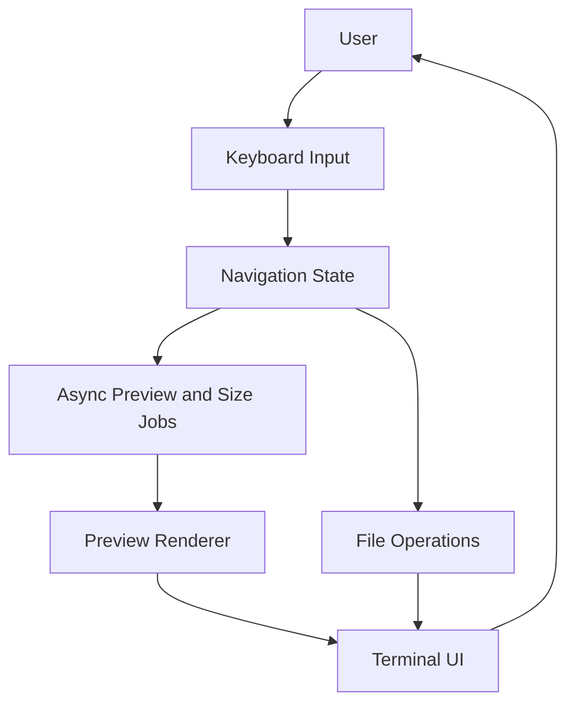

```text
╔══╦ ╦╔═╗╔═╗╔╗╔╔═╗╦═╗
╠══╚╦╝╔═╝║╣ ║║║║ ║╠╦╝
╩   ╩ ╚═╝╚═╝╝╚╝╚═╝╩╚═
```

<div align="center">


# Fyzenor

**A modern terminal file manager in C++17 with asynchronous previews, fast keyboard navigation, and a polished three-column interface.**

[](https://isocpp.org/)
[](https://invisible-island.net/ncurses/)
[](https://sw.kovidgoyal.net/kitty/graphics-protocol/)
[](#installation)

<table>
  <tr>
    <td align="center" style="padding: 8px 18px;">
      <a href="https://github.com/Bimbok">
        
      </a>
      <br />
      <a href="https://github.com/Bimbok"><strong>@Bimbok</strong></a>
      <br />
      <sub>Creator / Maintainer</sub>
    </td>
  </tr>
</table>

</div>

## Overview

Fyzenor is built for users who want a keyboard-driven workflow without losing visual feedback. It keeps file navigation responsive by pushing expensive work like previews and directory sizing into background jobs.

## Screenshots

<div align="center">


<br /><br />

<br /><br />


</div>

## Features

| Feature | Description |
| --- | --- |
| Three-column layout | Browse pinned items, directories, and a live preview pane in a Miller-style layout. |
| Asynchronous tabs | Open multiple directories in native tabs and switch with `[` / `]` or `1`-`9`. |
| Interactive shell commands | Run shell commands with `:` and use foreground, background, or path placeholders. |
| Bulk rename | Rename multiple selected files in your editor when `r` is pressed. |
| Multi-open | Open many selected files at once, with text/code in your editor and media in `mpv` when available. |
| Symlink handling | Create and inspect symlinks with clear visual feedback for broken paths. |
| Sorting modes | Cycle through Name, Size, and Date Modified with `s`. |
| Async previews | Render image and video previews in the background using Kitty Graphics and `ffmpeg`. |
| Text preview | Preview code and text files with `bat` or `batcat`, with a plain-text fallback. |
| Background folder sizing | Calculate directory sizes without blocking navigation. |
| Vim-style navigation | Move quickly with `h`, `j`, `k`, `l`, `g`, `G`, arrows, and Enter. |
| Multi-selection | Copy, cut, paste, delete, and zip many files at once. |
| Persistent pins | Save frequent directories to `~/.fm_pins`. |
| Dual-pane mode | Toggle a split file list view with `F2` for easier comparison and copying. |
| Device detection | Detect and manage mounted USB drives and Android MTP devices. |
| Live refresh | Automatically update the view when files change on disk. |
| Theming | Customize colors through `~/.config/fyzenor/colors.fz`, with optional Matugen support. |

## Requirements

Fyzenor works best in a terminal with Kitty Graphics Protocol support. Kitty is the primary target, while WezTerm and Konsole may also work.

### Core dependencies

- A C++17 compiler with `std::filesystem` support
- `ncursesw` development headers
- `ffmpeg`
- `zip`
- `ripgrep` (`rg`)
- `bat` or `batcat`
- `xclip`, `wl-copy`, or `pbcopy` for clipboard integration

### Linux packages

Debian / Ubuntu:

```bash
sudo apt update
sudo apt install build-essential libncursesw5-dev ffmpeg zip bat xclip wl-copy ripgrep
```

Fedora:

```bash
sudo dnf update
sudo dnf install gcc gcc-c++ make ncurses-devel ffmpeg zip bat xclip wl-clipboard ripgrep
```

### Windows notes

Windows builds need a compiler with working C++17 filesystem support. Older MinGW GCC releases may fail with `filesystem: No such file or directory`.

Recommended options:

- MSYS2 MinGW-w64
- WSL (Windows Subsystem for Linux)
- GCC 8+ or Clang 7+

Check your compiler version with:

```bash
g++ --version
```

## Installation

### Quick install

```bash
curl -fsSL https://raw.githubusercontent.com/Bimbok/fyzenor/main/install.sh | bash
```

### Manual install

```bash
git clone https://github.com/Bimbok/fyzenor.git
cd fyzenor
chmod +x install.sh
./install.sh
```

The installer compiles the binary, installs it to `/usr/local/bin/fyzenor`, creates an `fm` symlink, and installs a desktop entry plus icon when possible.

### Manual build

If you want to compile and run locally without installing:

```bash
git clone https://github.com/Bimbok/fyzenor.git
cd fyzenor
g++ -std=c++17 -O3 file_manager.cpp -o fyzenor -lncursesw -lpthread
./fyzenor
```

## Usage

Fyzenor provides a small CLI surface:

| Option | Description |
| --- | --- |
| `-v`, `--version` | Show the current version. |
| `-h`, `--help` | Show the help message. |

Example:

```bash
fyzenor --version
```

## Controls

### Navigation

| Key | Action |
| --- | --- |
| `k` / `↑` | Move selection up |
| `j` / `↓` | Move selection down |
| `h` / `←` / `Backspace` | Go to parent directory or clear search results |
| `l` / `→` / `Enter` | Open file or enter directory |
| `g` | Jump to the top |
| `G` | Jump to the bottom |
| `/` | Search content with `ripgrep` |
| `f` | Open the built-in fuzzy finder |
| `w` | Open the active tasks overlay |

Fyzenor detects text and code files and opens them with your configured editor, following `$EDITOR`, `$VISUAL`, then common fallbacks like `nvim`, `nano`, and `vi`. Media files use `mpv` when available.

### File operations

| Key | Action |
| --- | --- |
| `y` | Copy selected items |
| `x` | Cut selected items |
| `p` | Paste items from the clipboard |
| `Y` | Paste items as absolute symlinks |
| `d` / `Delete` | Delete selected items with confirmation |
| `r` | Rename the current item or bulk rename selected items |
| `n` | Create a new file |
| `N` | Create a new folder |
| `z` | Zip the current selection |
| `c` | Copy the absolute path of the current item |

### Selection, view, and layout

| Key | Action |
| --- | --- |
| `Space` / `v` | Toggle selection for the current file |
| `a` | Select all files in the current directory |
| `Esc` | Clear all selections |
| `.` | Toggle hidden files |
| `s` | Cycle sorting between Name, Size, and Date Modified |
| `P` | Pin the current directory |
| `Tab` | Switch focus between files and pins, or switch panes in dual-pane mode |
| `F2` | Toggle dual-pane mode |
| `F5` / `Ctrl+R` | Refresh the directory view and clear preview caches |
| `i` | Show file details |
| `m` | Show devices and mounts |
| `:` | Execute a shell command |
| `q` | Quit Fyzenor |

### Tabs

| Key | Action |
| --- | --- |
| `t` | Create a new tab |
| `W` / `Ctrl+W` | Close the current tab |
| `[` / `]` | Switch to the previous or next tab |
| `1`-`9`, `0` | Jump directly to a tab (`0` maps to tab 10) |

### Pin mode

- `j` / `k` or `↑` / `↓`: Move through pins.
- `Enter` / `l` / `→`: Open the selected pinned directory.
- `d` / `Delete`: Remove a pin.
- `Tab`: Return to the main browser.

## Customization

Fyzenor reads theme colors from `~/.config/fyzenor/colors.fz`. The default theme is Catppuccin Mocha.

### Manual theme file

```text
DIR: #89b4fa
FILE: #cdd6f4
SEL_BG: #585b70
MEDIA: #f9e2af
IMAGE: #f5c2e7
BORDER: #b4befe
SUCCESS: #a6e3a1
ERROR: #f38ba8
MULTI: #fab387
PIN_BG: #cba6f7
PIN_BORDER: #89b4fa
SEC_SEL_BG: #313244
CODE: #a6e3a1
ARCHIVE: #eba0ac
```

### Matugen integration

Create `~/.config/matugen/templates/fyzenor-colors.template`:

```text
# Fyzenor Theme: Matugen Generated
DIR: {{colors.primary.default.hex}}
FILE: {{colors.on_surface.default.hex}}
SEL_BG: {{colors.surface_variant.default.hex}}
MEDIA: {{colors.tertiary.default.hex}}
IMAGE: {{colors.secondary.default.hex}}
BORDER: {{colors.outline.default.hex}}
SUCCESS: {{colors.primary_fixed.default.hex}}
ERROR: {{colors.error.default.hex}}
MULTI: {{colors.tertiary_container.default.hex}}
PIN_BG: {{colors.secondary_container.default.hex}}
PIN_BORDER: {{colors.primary.default.hex}}
SEC_SEL_BG: {{colors.surface_dim.default.hex}}
```

Then add this to `~/.config/matugen/config.toml`:

```toml
[templates.fyzenor]
input_path = "~/.config/matugen/templates/fyzenor-colors.template"
output_path = "~/.config/fyzenor/colors.fz"
```

Generate a theme with:

```bash
matugen image /path/to/your/wallpaper.jpg
```

## Project Structure

```text
fyzenor/
├── file_manager.cpp   # Core application logic, UI rendering, and preview pipeline
├── install.sh         # Installer and shell integration bootstrap
├── fyzenor.png        # Branding asset used in the README
└── Sample/            # Showcase screenshots
```

## Architecture

Fyzenor keeps the UI responsive by separating navigation from expensive background work.

1. Navigation state tracks the active directory, selection, pins, and tabs.
2. Async jobs generate previews and compute directory sizes without blocking input.
3. File operations are handled through keyboard shortcuts and shell integration.



## Contributing

Contributions are welcome.

1. Fork the repository.
2. Create a feature branch.
3. Make your changes.
4. Test locally.
5. Open a pull request with a clear description.

See [CONTRIBUTING.md](CONTRIBUTING.md) for detailed contribution guidelines, and [CODE_OF_CONDUCT.md](CODE_OF_CONDUCT.md) for community expectations.

## Contact

- GitHub: [Bimbok](https://github.com/Bimbok)
- Issues: [Open an issue](https://github.com/Bimbok/fyzenor/issues)

## License

Distributed under the MIT License. See [LICENSE](LICENSE) for details.


