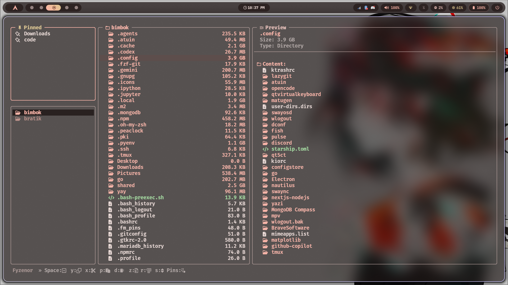
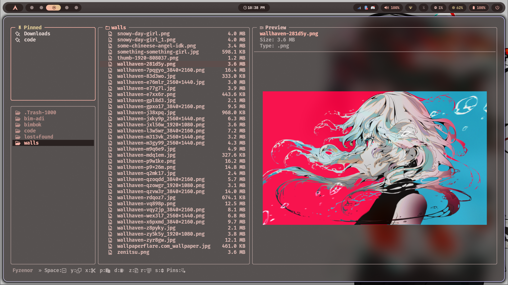
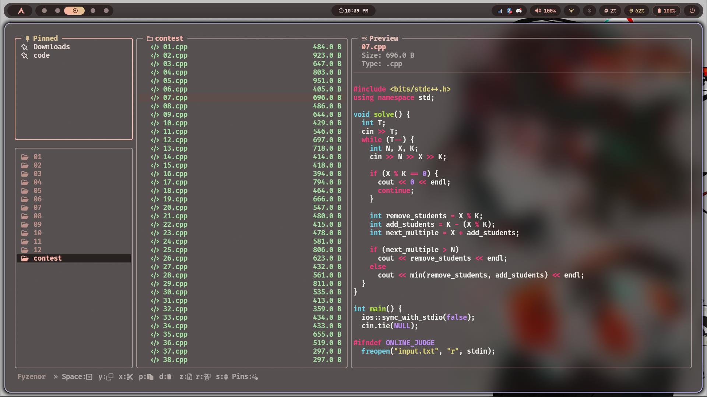

```text
╔══╦ ╦╔═╗╔═╗╔╗╔╔═╗╦═╗
╠══╚╦╝╔═╝║╣ ║║║║ ║╠╦╝
╩   ╩ ╚═╝╚═╝╝╚╝╚═╝╩╚═
```

<div align="center">


<br/><br/>

<br/><br/>


<br/><br/>

> _ The Blazing Fast, Modern C++ Terminal File Manager.

[](https://isocpp.org/)
[](LICENSE)
[](https://www.linux.org/)
[](https://sw.kovidgoyal.net/kitty/graphics-protocol/)

</div>

---

## ⚡ Introduction

**Fyzenor** is a lightweight, high-performance terminal file manager engineered from the ground up with modern **C++17**. It is designed to bridge the gap between the raw power of the command line and the visual feedback of modern GUIs. 

With its asynchronous architecture, Fyzenor ensures that heavy operations like directory size calculation and media preview generation never block the UI, providing a "blazing fast" experience even on large filesystems. Whether you are a developer, a system administrator, or a power user, Fyzenor allows you to navigate and manage your files with the speed of thought.

---

## 🚀 Key Features

- **📁 Three-Column Miller Architecture:** A classic and intuitive view showing (Parent Directory → Current Directory → Preview). This layout provides instant spatial context as you dive deep into your filesystem.
- **🖼️ Asynchronous Media Previews:** High-resolution image and video thumbnails rendered directly within the terminal using the **Kitty Graphics Protocol**. Previews are generated and cached in the background, ensuring zero UI freezing or lag during navigation.
- **✨ Modern & Polished UI:** A clean, minimal interface featuring rounded corners, optimized spacing, and an elegant color palette designed for long-term readability and comfort.
- **⚡ Background Directory Sizing:** Directory sizes are calculated asynchronously. You'll see a `...` indicator while Fyzenor traverses large folders, updating the UI live once the final size is known.
- **🧭 Fluid Vim-Like Navigation:** Muscle memory carries over seamlessly with `h`, `j`, `k`, `l` movements, along with advanced jumps like `g` (top) and `G` (bottom).
- **✨ Nerd Fonts Integration:** Rich iconography for directories, archives, media, and over 30+ code file formats, making visual identification near-instant.
- **🎨 Deep Customization:** Fully themeable interface via simple hex-code configuration files. Supports **Matugen** for generating themes directly from your desktop wallpaper.
- **📌 Persistent Directory Pins:** Bookmark your most-used locations. Pins are saved to `~/.fm_pins` and persist across reboots and sessions.
- **⚡ Flicker-Free Rendering:** Optimized state management and smart redrawing logic ensure the UI only updates exactly when needed, saving CPU cycles and providing a smooth experience.
- **📝 Comprehensive File Operations:** Full support for Yank (Copy), Cut, Paste, Rename, Delete (with confirmation), New File, New Folder, and Zip compression.
- **✅ Advanced Multi-Selection:** Easily select individual files or entire groups for bulk operations using simple, intuitive keybindings.
- **🔌 Intelligent Editor Integration:** Automatically detects and respects your `$EDITOR` (e.g., `nvim`, `nano`, `vi`) for opening code and text files.

---

## 🛠️ Prerequisites

To unleash the full power of Fyzenor (especially image previews), your system needs a few core components:

### 1. A Compatible Terminal
- **Recommended:** [Kitty](https://sw.kovidgoyal.net/kitty/) (Native support for the Kitty Graphics Protocol).
- **Others:** [WezTerm](https://wezfurlong.org/wezterm/) or [Konsole](https://konsole.kde.org/) may work, but Kitty is the primary development and testing target.

### 2. System Dependencies (Debian/Ubuntu based)

```bash
sudo apt update
sudo apt install build-essential libncursesw5-dev ffmpeg zip bat xclip wl-copy
```

- **`libncursesw`**: Essential for wide-character (Unicode/Icon) TUI rendering.
- **`ffmpeg`**: Powering the asynchronous thumbnail generation for images and videos.
- **`zip`**: Required for the built-in archive creation feature (`z`).
- **`bat` (or `batcat`)**: Used for high-performance, syntax-highlighted text previews.
- **`xclip` / `wl-copy` / `pbcopy`**: Required for the "Copy Path" (`c`) feature to interact with your system clipboard.

---

## ⚙️ Installation & Update

The easiest way to install or update Fyzenor is using the universal installation script.

### One-Liner (Recommended)

Run this command in your terminal to automatically download, compile, and install (or update) Fyzenor. It will also create an `fm` symlink and set up shell integration:

```bash
curl -fsSL https://raw.githubusercontent.com/Bimbok/fyzenor/main/install.sh | bash
```

### Manual Installation & Updates

If you prefer to handle things yourself or have already cloned the repository:

```bash
# 1. Enter the repository
cd fyzenor

# 2. Run the installer
./install.sh
```

**The installer performs the following actions:**
1. Compiles the modern C++ source into a highly optimized binary.
2. Installs the binary as `fyzenor` in `/usr/local/bin/`.
3. Creates a convenient symlink named `fm` for faster access.
4. Appends the `f` shell function to your `.bashrc` or `.zshrc` to enable "Jump to CWD on exit."

---

## 🎨 Customization & Theming

Fyzenor supports custom themes via a simple configuration file located at `~/.config/fyzenor/colors.fz`. The default theme is **Catppuccin Mocha**.

### Configuration Format

Create `~/.config/fyzenor/colors.fz` and define colors using hex codes:

```text
DIR: #89b4fa
FILE: #cdd6f4
SEL_BG: #585b70
MEDIA: #f9e2af
IMAGE: #f5c2e7
BORDER: #b4befe
SUCCESS: #a6e3a1
ERROR: #f38ba8
MULTI: #fab387
PIN_BG: #cba6f7
PIN_BORDER: #89b4fa
SEC_SEL_BG: #313244
CODE: #a6e3a1
ARCHIVE: #eba0ac
```

### Wallpaper-Based Theming (Matugen)

Instead of manually writing colors, you can use **Matugen** to generate a theme that matches your current wallpaper.

#### Step 1: Create the Matugen Template
Create `~/.config/matugen/templates/fyzenor-colors.template`:

```text
# Fyzenor Theme: Matugen Generated
DIR: {{colors.primary.default.hex}}
FILE: {{colors.on_surface.default.hex}}
SEL_BG: {{colors.surface_variant.default.hex}}
MEDIA: {{colors.tertiary.default.hex}}
IMAGE: {{colors.secondary.default.hex}}
BORDER: {{colors.outline.default.hex}}
SUCCESS: {{colors.primary_fixed.default.hex}}
ERROR: {{colors.error.default.hex}}
MULTI: {{colors.tertiary_container.default.hex}}
PIN_BG: {{colors.secondary_container.default.hex}}
PIN_BORDER: {{colors.primary.default.hex}}
SEC_SEL_BG: {{colors.surface_dim.default.hex}}
```

#### Step 2: Update your Matugen Config
Add this block to your `~/.config/matugen/config.toml`:

```toml
[templates.fyzenor]
input_path = "~/.config/matugen/templates/fyzenor-colors.template"
output_path = "~/.config/fyzenor/colors.fz"
```

#### Step 3: Generate the Colors
```bash
matugen image /path/to/your/wallpaper.jpg
```

---

## 🛠️ CLI Usage

Fyzenor supports the following command-line arguments:

| Option               | Description                               |
| :------------------- | :---------------------------------------- |
| `-v`, `--version`    | Display the current version of Fyzenor.   |
| `-h`, `--help`       | Show the help message and exit.           |
| `--cwd-file <file>`  | Write the final working directory to <file> on exit. |

```bash
# Example: Check version
fyzenor --version
```

---

## 🔌 Shell Integration (Jump to CWD on exit)

Fyzenor can change your shell's current working directory upon exit. If you use the installer, this is handled automatically for `.bashrc` and `.zshrc`. 

Otherwise, add this function to your shell configuration:

```bash
# Fyzenor CWD Integration
function f() {
	local tmp="$(mktemp -t "fyzenor-cwd.XXXXXX")" cwd
	fyzenor "$@" --cwd-file="$tmp"
	if [ -f "$tmp" ]; then
		cwd=$(cat "$tmp")
		rm -f -- "$tmp"
		if [ -n "$cwd" ] && [ "$cwd" != "$PWD" ]; then
			builtin cd -- "$cwd"
		fi
	fi
}
```

Now, run `f` instead of `fyzenor`. When you exit, your shell will automatically jump to your last visited directory.

---

## ⌨️ Controls

### Navigation

| Key                   | Action                      |
| :-------------------- | :-------------------------- |
| `k` or `↑`            | Move selection up           |
| `j` or `↓`            | Move selection down         |
| `h` or `←` or `BS`    | Go to parent directory      |
| `l` or `→` or `Enter` | **Open file** / Enter directory |
| `g`                   | Go to top of list           |
| `G`                   | Go to bottom of list        |

> **Note on Opening Files:** Fyzenor automatically detects text and code files and opens them using your terminal-based editor (respecting `$EDITOR` → `$VISUAL` → `nvim` → `nano` → `vi`). Media files are opened with `mpv` (if available), and other files use your system's default opener (`xdg-open` or `open`).

### File Operations

| Key             | Action                                        |
| :-------------- | :-------------------------------------------- |
| `y`             | **Yank** (Copy) selected items to internal clipboard |
| `x`             | **Cut** selected items                        |
| `p`             | **Paste** items from clipboard                |
| `d` or `Delete` | **Delete** selected items (with confirmation) |
| `r`             | **Rename** current item                       |
| `n`             | Create **New File**                           |
| `N`             | Create **New Folder**                         |
| `z`             | **Zip** selected items into an archive        |
| `c`             | **Copy Absolute Path** to system clipboard    |

### Selection, View & Pins

| Key            | Action                                    |
| :------------- | :---------------------------------------- |
| `Space` or `v` | Toggle selection of current file          |
| `a`            | Select **All** files in current directory |
| `Esc`          | **Clear** all active selections           |
| `.`            | Toggle hidden files (dotfiles)            |
| `s`            | Toggle sorting by **Size** vs Name        |
| `P`            | Pin current directory (Persistent)        |
| `Tab`          | Toggle focus between **Files** and **Pins** |
| `q`            | Quit Fyzenor                              |

### Pin Mode Controls

When focused on the **Pins** column (using `Tab`):

- `j` / `k` or `↑` / `↓`: Navigate through your pins.
- `Enter` / `l` / `→`: Instantly jump to the pinned directory.
- `d` / `Delete`: Remove the selected pin.
- `Tab`: Switch focus back to the main file browser.

---

## 🎨 Visuals & Protocols

### Kitty Graphics Protocol
Fyzenor utilizes the [Kitty Graphics Protocol](https://sw.kovidgoyal.net/kitty/graphics-protocol/) for high-resolution image and video previews. Unlike older protocols that use ASCII art or low-res blocks, this provides true-color, pixel-perfect rendering. Previews are generated asynchronously, so the UI remains fluid even when scrolling through thousands of images.

### Nerd Fonts
Icons are rendered using [Nerd Fonts](https://www.nerdfonts.com/). Ensure your terminal is using a Nerd Font for icons to display correctly. Supported categories include media, code, archives, and system folders.

### Syntax Highlighting
Text file previews benefit from syntax highlighting powered by `bat` (or `batcat`). If `bat` is not installed, Fyzenor falls back to a plain text preview. Binary files are automatically detected and skipped to prevent terminal corruption.

---

## 🤝 Contributing

Contributions are welcome! Whether it's reporting a bug, suggesting a feature, or submitting a pull request.

1.  Fork the repository.
2.  Create your feature branch (`git checkout -b feature/AmazingFeature`).
3.  Commit your changes (`git commit -m 'Add some AmazingFeature'`).
4.  Push to the branch (`git push origin feature/AmazingFeature`).
5.  Open a pull request.

---

## ⚖️ License

Distributed under the MIT License. See `LICENSE` for more information.
